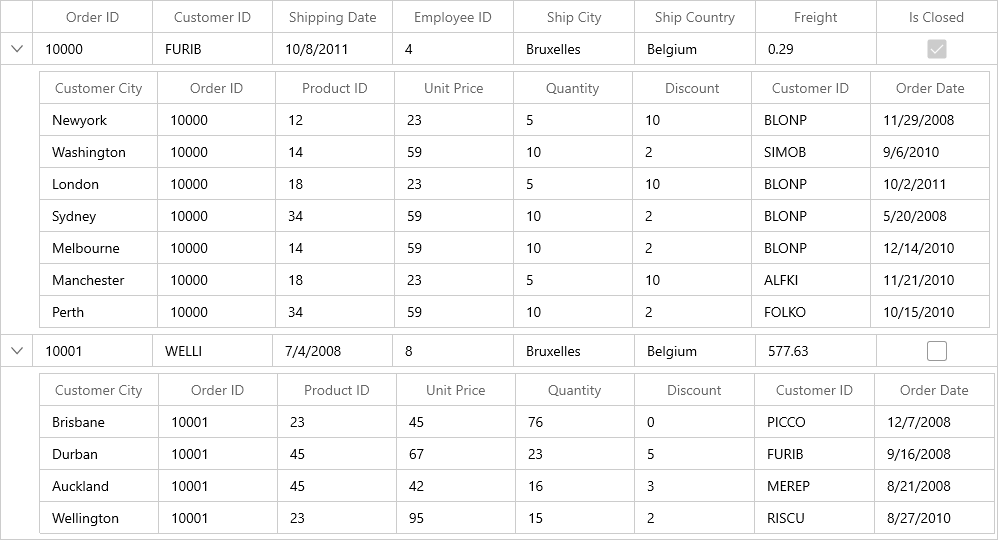
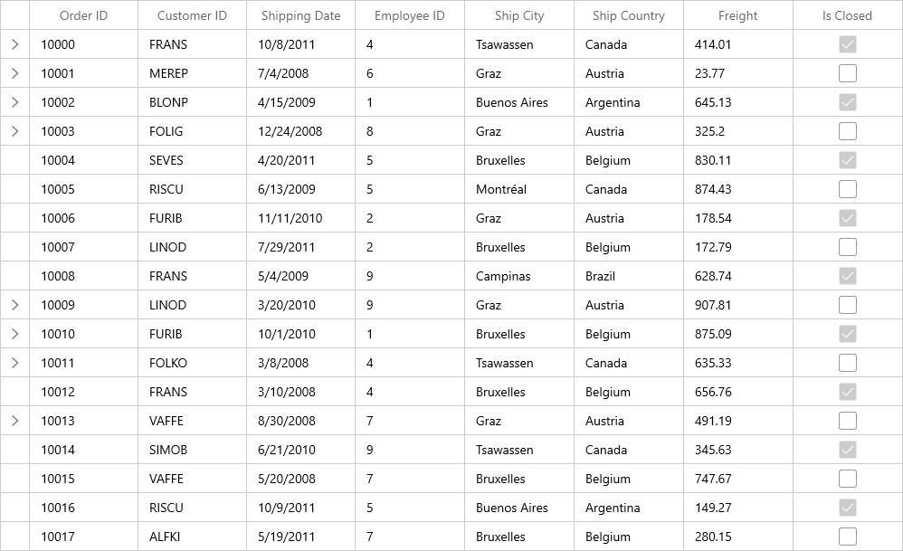

# How to create Nested DataGrid View (Master Details View) in WinUI?

## About the sample

This example illustrates how to create Nested DataGrid View (Master Details View) in WinUI?

[WinUI DataGrid](https://www.syncfusion.com/winui-controls/datagrid) (SfDataGrid) provides support to represent the hierarchical data in the form of nested tables using Master-Details View. You can expand or collapse the nested tables by using an expander in a row or programmatically.

## Generating Master-Details view from IEnumerable

Master-Details View’s relation can be generated for the properties of type [IEnumerable](https://docs.microsoft.com/en-us/dotnet/api/system.collections.ienumerable?view=net-5.0) exists in the underlying data object.

### Auto-generating relations

SfDataGrid can automatically generate relations and inner relations for the IEnumerable type properties in the underlying data object. This can be enabled by setting [SfDataGrid.AutoGenerateRelations](https://help.syncfusion.com/cr/winui/Syncfusion.UI.Xaml.DataGrid.SfDataGrid.html#Syncfusion_UI_Xaml_DataGrid_SfDataGrid_AutoGenerateRelations) to true.

``` Xaml

<syncfusion:SfDataGrid x:Name="dataGrid”
                       AllowGrouping="True"
                       AutoGenerateColumns="True"
                       AutoGenerateRelations="False"
                       ItemsSource="{Binding Path=OrdersDetails}"/>
```                                            

When relations are auto-generated, you can handle the [SfDataGrid.AutoGeneratingRelations](https://help.syncfusion.com/cr/winui/Syncfusion.UI.Xaml.DataGrid.SfDataGrid.html#Syncfusion_UI_Xaml_DataGrid_SfDataGrid_AutoGeneratingRelations) event to customize or cancel the [GridViewDefinition](https://help.syncfusion.com/cr/winui/Syncfusion.UI.Xaml.DataGrid.GridViewDefinition.html) before they are added to the [SfDataGrid.DetailsViewDefinition](https://help.syncfusion.com/cr/winui/Syncfusion.UI.Xaml.DataGrid.DetailsViewDefinition.html).

### Manually defining Relations

You can define the Master-Details View’s relation manually using [SfDataGrid.DetailsViewDefinition](https://help.syncfusion.com/cr/winui/Syncfusion.UI.Xaml.DataGrid.DetailsViewDefinition.html), when the [SfDataGrid.AutoGenerateRelations](https://help.syncfusion.com/cr/winui/Syncfusion.UI.Xaml.DataGrid.SfDataGrid.html#Syncfusion_UI_Xaml_DataGrid_SfDataGrid_AutoGenerateRelations) is false.

To define Master-Details View relations, create [GridViewDefinition](https://help.syncfusion.com/cr/winui/Syncfusion.UI.Xaml.DataGrid.GridViewDefinition.html) and set the name of IEnumerable type property (from data object) to [ViewDefinition.RelationalColumn](https://help.syncfusion.com/cr/winui/Syncfusion.UI.Xaml.DataGrid.ViewDefinition.html#Syncfusion_UI_Xaml_DataGrid_ViewDefinition_RelationalColumn). Then, add the GridViewDefinition to the [SfDataGrid.DetailsViewDefinition](https://help.syncfusion.com/cr/winui/Syncfusion.UI.Xaml.DataGrid.DetailsViewDefinition.html).

``` Xaml

<syncfusion:SfDataGrid x:Name="dataGrid"
                       AutoGenerateColumns="True"
                       AutoGenerateRelations="False"
                       ItemsSource="{Binding Path=OrdersDetails}">
            <syncfusion:SfDataGrid.DetailsViewDefinition>
                <syncfusion:GridViewDefinition RelationalColumn="OrderDetails">
                    <syncfusion:GridViewDefinition.DataGrid>
                        <syncfusion:SfDataGrid x:Name="FirstDetailsViewGrid"  ColumnWidthMode="Star" >
                        </syncfusion:SfDataGrid>
                    </syncfusion:GridViewDefinition.DataGrid>
                </syncfusion:GridViewDefinition>
            </syncfusion:SfDataGrid.DetailsViewDefinition>
</syncfusion:SfDataGrid> 
```



## Expanding and collapsing the DetailsViewDataGrid programmatically

SfDataGrid allows you to expand or collapse the [DetailsViewDataGrid](https://help.syncfusion.com/cr/winui/Syncfusion.UI.Xaml.DataGrid.DetailsViewDataGrid.html) programmatically in different ways.

### Expand or collapse all the DetailsViewDataGrid

You can expand or collapse all the [DetailsViewDataGrid](https://help.syncfusion.com/cr/winui/Syncfusion.UI.Xaml.DataGrid.DetailsViewDataGrid.html) programmatically by using [ExpandAllDetailsView](https://help.syncfusion.com/cr/winui/Syncfusion.UI.Xaml.DataGrid.SfDataGrid.html#Syncfusion_UI_Xaml_DataGrid_SfDataGrid_ExpandAllDetailsView) and [CollapseAllDetailsView](https://help.syncfusion.com/cr/winui/Syncfusion.UI.Xaml.DataGrid.SfDataGrid.html#Syncfusion_UI_Xaml_DataGrid_SfDataGrid_CollapseAllDetailsView) methods.

``` C#
this.dataGrid.ExpandAllDetailsView();
this.dataGrid.CollapseAllDetailsView();
```

### Expand DetailsViewDataGrid based on level

You can expand all the [DetailsViewDataGrid](https://help.syncfusion.com/cr/winui/Syncfusion.UI.Xaml.DataGrid.DetailsViewDataGrid.html) programmatically based on level using [ExpandAllDetailsView](https://help.syncfusion.com/cr/winui/Syncfusion.UI.Xaml.DataGrid.SfDataGrid.html#Syncfusion_UI_Xaml_DataGrid_SfDataGrid_ExpandAllDetailsView) method.

``` C#
this.dataGrid.ExpandAllDetailsView(2);
```

### Expand or collapse Details View based on record index

You can expand or collapse [DetailsViewDataGrid](https://help.syncfusion.com/cr/winui/Syncfusion.UI.Xaml.DataGrid.DetailsViewDataGrid.html) based on the record index by using [ExpandDetailsViewAt](https://help.syncfusion.com/cr/winui/Syncfusion.UI.Xaml.DataGrid.SfDataGrid.html#Syncfusion_UI_Xaml_DataGrid_SfDataGrid_ExpandAllDetailsView_System_Int32_) and [CollapseDetailsViewAt](https://help.syncfusion.com/cr/winui/Syncfusion.UI.Xaml.DataGrid.SfDataGrid.html#Syncfusion_UI_Xaml_DataGrid_SfDataGrid_CollapseDetailsViewAt_System_Int32_) methods.

``` C#
this.dataGrid.ExpandDetailsViewAt(0);
this.dataGrid.CollapseDetailsViewAt(0);
```

## Defining properties for DetailsViewDataGrid When AutoGenerateRelations is false

For manually defined relation, the properties can be directly set to the [GridViewDefinition.DataGrid](https://help.syncfusion.com/cr/winui/Syncfusion.UI.Xaml.DataGrid.GridViewDefinition.html#Syncfusion_UI_Xaml_DataGrid_GridViewDefinition_DataGrid).

``` XML
<syncfusion:SfDataGrid x:Name="dataGrid"
                       Margin="5"
                       AllowGrouping="True"
                       AutoGenerateColumns="True"
                       AutoGenerateRelations="False"
                       ColumnWidthMode="Star"
                       HideEmptyGridViewDefinition="True"
                       ItemsSource="{Binding Path=OrdersDetails}">
            <syncfusion:SfDataGrid.DetailsViewDefinition>
                <syncfusion:GridViewDefinition RelationalColumn="OrderDetails">
                    <syncfusion:GridViewDefinition.DataGrid>
                        <syncfusion:SfDataGrid x:Name="FirstDetailsViewGrid"
                                               AllowEditing="True"
                                               AllowFiltering="True"
                                               AllowResizingColumns="True"
                                               AllowSorting="True"
                                               AutoGenerateColumns="False" >
                        </syncfusion:SfDataGrid>
                    </syncfusion:GridViewDefinition.DataGrid>
                </syncfusion:GridViewDefinition>
            </syncfusion:SfDataGrid.DetailsViewDefinition>
        </syncfusion:SfDataGrid>
```

## Defining properties for DetailsViewDataGrid When AutoGenerateRelations is true

When the relation is auto-generated, you can get the [GridViewDefinition.DataGrid](https://help.syncfusion.com/cr/winui/Syncfusion.UI.Xaml.DataGrid.GridViewDefinition.html#Syncfusion_UI_Xaml_DataGrid_GridViewDefinition_DataGrid) in the [AutoGeneratingRelations](https://help.syncfusion.com/cr/winui/Syncfusion.UI.Xaml.DataGrid.SfDataGrid.html#Syncfusion_UI_Xaml_DataGrid_SfDataGrid_AutoGeneratingRelations) event handler to set the properties.

``` C#
this.dataGrid.AutoGeneratingRelations += dataGrid_AutoGeneratingRelations;

void dataGrid_AutoGeneratingRelations(object sender, Syncfusion.UI.Xaml.Grid.AutoGeneratingRelationsArgs e)
{
     e.GridViewDefinition.DataGrid.AllowEditing = true;
     e.GridViewDefinition.DataGrid.AllowFiltering = true;
     e.GridViewDefinition.DataGrid.AllowSorting = true;
     e.GridViewDefinition.DataGrid.AllowResizingColumns = true;
}
```

## Hiding expander when parent record’s relation property has an empty collection or null

By default, the expander will be visible for all the data rows in parent DataGrid even if its [RelationalColumn](https://help.syncfusion.com/cr/winui/Syncfusion.UI.Xaml.DataGrid.ViewDefinition.html#Syncfusion_UI_Xaml_DataGrid_ViewDefinition_RelationalColumn) property has an empty collection or null.
You can hide the expander from the view when corresponding RelationalColumn property has an empty collection or null, by setting [HideEmptyGridViewDefinition](https://help.syncfusion.com/cr/winui/Syncfusion.UI.Xaml.DataGrid.SfDataGrid.html#Syncfusion_UI_Xaml_DataGrid_SfDataGrid_HideEmptyGridViewDefinition) property as true.

``` XML
<syncfusion:SfDataGrid x:Name="dataGrid"
                       HideEmptyGridViewDefinition="True"
                       ItemsSource="{Binding Path=OrdersDetails}"/>
```



Take a moment to peruse the [WinUI DataGrid - Nested Grid](https://help.syncfusion.com/winui/datagrid/master-details-view) documentation, where you can find about nested grid, with code examples.

## Requirements to run the demo 

Visual Studio 2015 and above versions.
